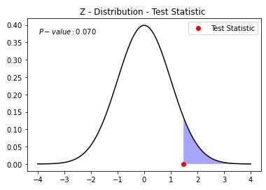

# HypothesisTesting

## Basic Explanation for Z-test
Using scipy 1.70 version  
If Jupyter file make rendering issue,  
Go below url to see jupyter notebook  
https://nbviewer.jupyter.org/gist/peardragon/86002321f4790268d810002f879be6e0
